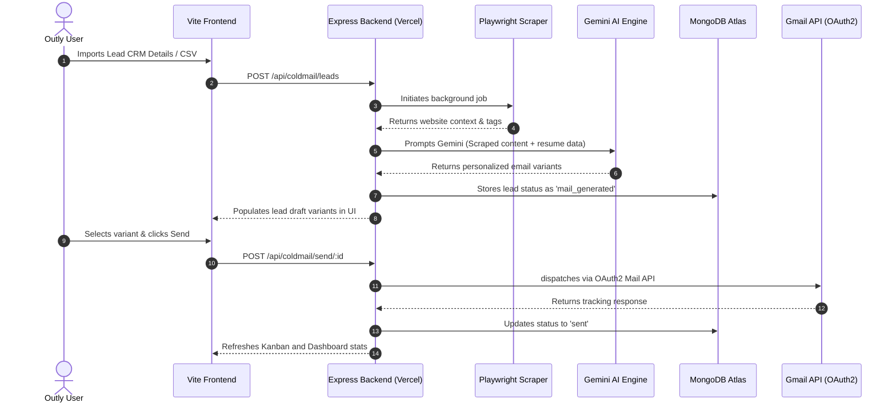

<div align="center">

# 🌌 Outly

### *AI-Powered Personal Career Automation System*

Stop applying manually. Let AI automate your outreach, resume tailoring, and job tracking. Outly is a premium full-stack SaaS platform that handles your entire job search pipeline—from website-scraped cold emails and ATS-optimized resumes to a drag-and-drop Kanban tracker and automated notifications—all in one unified, modern dashboard.

[](https://outly.online)
[](#)
[](#)

<br/>

---

**[🌐 Live Site](https://outly.online)** &nbsp;|&nbsp; **[⚡ Quickstart](#-getting-started)** &nbsp;|&nbsp; **[📁 Architecture](#-project-architecture)** &nbsp;|&nbsp; **[🔌 API Reference](#-api-endpoints)** &nbsp;|&nbsp; **[💎 Free vs Pro](#-free-vs-pro-plan)**

---

</div>

## 🎯 The Problem

Job hunting is an exhausting, repetitive grind. Spending hours writing cold emails, rewriting bullet points to fit specific Job Descriptions (JDs), updating tracking spreadsheets, and missing follow-ups drain candidates. 

**Outly solves this.** It automates your career outreach by web-scraping target companies, dynamically tailoring resumes using Google Gemini AI, scheduling social posts, and organizing your pipeline on a visual Kanban board.

---

## ⚡ Current System Analysis & Features

Our core system consists of a Vite-powered React frontend and an Express backend, deployed as a monorepo structure. Below is the live status of all system components:

### 🟢 Live & Fully Integrated

#### 🔐 Authentication & Onboarding
*   **Secure Auth**: Native Signup/Login with `bcrypt` password hashing and JWT access tokens.
*   **Google OAuth**: One-click registration/login using Google Gmail OAuth2.
*   **Interactive Onboarding**: Guided multi-step onboarding wizard ([Onboarding.tsx](file:///c:/Users/dhuva/Desktop/Bharat%20Dhuva/Projects/Outly/frontend/src/pages/Onboarding.tsx)) to establish target roles, cities, core skills, and experience levels.
*   **Mobile Hub**: Dedicated responsive mobile hub navigation ([MobileHub.tsx](file:///c:/Users/dhuva/Desktop/Bharat%20Dhuva/Projects/Outly/frontend/src/pages/MobileHub.tsx)) for seamless usage on small-screen viewports.

#### 📧 AI Cold Email Outreach Engine
*   **Lead CRM & CSV Import**: Import recruiter and manager leads individually or in bulk via CSV parsing.
*   **Company Scraper**: Built-in Playwright + Cheerio scraper ([companyScraper.ts](file:///c:/Users/dhuva/Desktop/Bharat%20Dhuva/Projects/Outly/backend/src/automation/coldmail/companyScraper.ts)) that fetches company homepage/career pages context for hyper-personalized messaging.
*   **AI Cold Mail Generation**: Gemini AI generates personalized email subject lines and body copies. Supports multi-variant generation (A/B testing drafts).
*   **OAuth2 Email Sender**: Direct integration with the Google Gmail API to send emails straight from the user's Gmail mailbox.
*   **Rate Limit & Queuing**: Uses Bull Redis-backed queues with random delays (3 to 7 minutes) to mimic natural human behavior and prevent spam blocking.
*   **Automated Follow-ups**: Node-cron jobs check for unresponsive recruiters and auto-generate follow-up sequences.

#### 📄 Resume Vault & Management
*   **Cloud & Mongoose Storage**: Dual storage model using Cloudinary URLs for fast CDN delivery and Base64-encoded strings directly in MongoDB for durable backups.
*   **Multi-Format Parsing**: Auto-extracts plaintext resume data from PDF and DOCX files using `pdf-parse` and `mammoth`.
*   **Cloud Sync**: Link and pull resumes directly from Google Drive using Google File IDs.

#### 🎯 ATS Resume Scoring & Tailoring
*   **AtsScore Workspace**: Drag and drop resumes to compare them against any target Job Description. Returns an ATS score (0-100), key skills gap analysis, missing keywords list, and formatting/impact recommendations ([AtsScore.tsx](file:///c:/Users/dhuva/Desktop/Bharat%20Dhuva/Projects/Outly/frontend/src/pages/AtsScore.tsx)).
*   **ResumeTailor Engine**: Auto-tailors and rewrites specific resume sections to align with missing keywords in target JDs while preserving factual employment history ([ResumeTailor.tsx](file:///c:/Users/dhuva/Desktop/Bharat%20Dhuva/Projects/Outly/frontend/src/pages/ResumeTailor.tsx)).
*   **PDF Export**: Formats the optimized resume and compiles it into a downloadable PDF.

#### 📋 Visual Job Tracker
*   **Kanban Pipeline**: Drag-and-drop workflow tracking application stages: `Saved` ➔ `Applied` ➔ `Interview` ➔ `Offer` ➔ `Rejected`.
*   **Timeline Logs**: Tracks notes, email threads, and contact touchpoints per application card.

#### 🔍 Job Finder Scraper
*   **Live Web Scraping**: Playwright-powered job search engine scraping real-time listings based on target roles, locations, and experience thresholds.
*   **One-Click Import**: Save discovered jobs directly from search results to your Kanban application board.

#### 🌅 Alerts & Analytics
*   **WhatsApp Integration**: Live notifications for critical events (new interview invitations, payment status, etc.) via Twilio.
*   **Daily Briefing Cron**: Automatically triggers at 8:00 AM daily, sending a list of active matches and follow-up alerts to the user.
*   **Performance Charts**: Custom Recharts visualization of outreach open/reply rates, subject line effectiveness, and weekly applications progress.

#### 💰 Payments & Monetization
*   **Razorpay Subscriptions**: Subscription order generation and secure payment webhook verification for upgrading from Free to Pro accounts.
*   **Feature Gate Middleware**: In-app limits restricting Free accounts to 3 resumes, 3 ATS matches per day, and 5 cold emails daily.

---

### 🟡 Mocked / Local Mode (Frontend Only)
*   **Social Content Scheduler**: The frontend supports editing, generating, and reviewing LinkedIn and Twitter posts, but operates in simulated/mock mode. Mongoose backend schema mapping is planned for upcoming milestones.

---

## 🔄 Recent Changelog: Added & Removed Code

To keep our architecture highly performant and scalable, the following changes were recently executed in the codebase:

### ➕ Newly Added
1.  **Resume Customization Workspace** ([ResumeTailor.tsx](file:///c:/Users/dhuva/Desktop/Bharat%20Dhuva/Projects/Outly/frontend/src/pages/ResumeTailor.tsx)): A dedicated UI for AI-optimized resume editing and section-by-section rewrites.
2.  **ATS Evaluation Center** ([AtsScore.tsx](file:///c:/Users/dhuva/Desktop/Bharat%20Dhuva/Projects/Outly/frontend/src/pages/AtsScore.tsx)): An analytics scoring platform that extracts keywords from job descriptions and provides a match breakdown.
3.  **Onboarding Setup Wizard** ([Onboarding.tsx](file:///c:/Users/dhuva/Desktop/Bharat%20Dhuva/Projects/Outly/frontend/src/pages/Onboarding.tsx)): Guideline settings handler that saves target locations, stack focus, and experience to Mongoose settings database.
4.  **Monorepo Mobile Navigation Shell** ([MobileHub.tsx](file:///c:/Users/dhuva/Desktop/Bharat%20Dhuva/Projects/Outly/frontend/src/pages/MobileHub.tsx)): Responsive navigation dock dynamically adapting for clean rendering across standard mobile viewports.
5.  **Omnipresent Dashboard Layout** ([DashboardLayout.tsx](file:///c:/Users/dhuva/Desktop/Bharat%20Dhuva/Projects/Outly/frontend/src/components/DashboardLayout.tsx)): Command search bar (⌘K) utility, sidebar navigation animations, page-transition loading screens.

### ➖ Removed & Deprecated
1.  **SQLite Database Engine (`better-sqlite3` / `schema.ts`)**: Deprecated and removed legacy local SQLite backend file operations. All core features (settings, activity logs, applications, companies, resume vault) now run on MongoDB Atlas via Mongoose models to allow serverless routing compatibility.
2.  **SMTP Gmail Credential Auth**: Replaced legacy SMTP mail transports with Google API OAuth2 authentication to prevent email authentication failures.

---

## 🛠️ System Architecture



---

## 🛠️ Technical Stack

| Component | Technology | Purpose |
| :--- | :--- | :--- |
| **Core Frontend** | React 18, Vite 5, TypeScript | Single Page Application framework & development builder |
| **Styling** | TailwindCSS 3, Shadcn/UI (Radix) | Responsive layout, modern UI components & design primitives |
| **Animations** | Framer Motion, GSAP | Fluid page routing transitions and interactive landing page micro-animations |
| **State Management** | TanStack React Query, Hook Form | Backend query caching, client-side mutations, form state handling |
| **Runtime & Server** | Node.js (v18+), Express 4 | API routing server written in strict TypeScript |
| **Database** | MongoDB Atlas, Mongoose 9 | Primary cloud-hosted document database for user documents |
| **Background Queue** | Redis, Bull Queue | Task queue with randomized timing intervals for cold mail sending |
| **Automation** | Playwright, Cheerio | Headless web browser scraping for companies and job finder |
| **Mail Services** | Nodemailer, Google OAuth2 | Direct Gmail API sender integration |
| **AI Models** | Google Gemini (Gemini 2.5 Flash), Claude, Grok | Multi-variant copy writing, ATS scoring, resume tailoring |

---

## 📁 Codebase Layout

```
Outly/
├── api/
│   └── index.js                      # Vercel serverless gateway function
├── backend/
│   ├── src/
│   │   ├── index.ts                  # Backend server entry & initialization
│   │   ├── api/
│   │   │   ├── server.ts             # Express server routes & middleware registry
│   │   │   └── routes/               # Modular API endpoint routers (auth, coldmail, ats, etc.)
│   │   ├── automation/
│   │   │   └── coldmail/             # Scraper, AI generators, and CSV parsers
│   │   ├── db/
│   │   │   ├── connection.ts         # Mongoose connection layer
│   │   │   └── models.ts             # Mongoose database schemas
│   │   ├── jobs/                     # Daily summaries and notification cron triggers
│   │   ├── queue/                    # Bull Redis background queues
│   │   ├── middleware/               # Auth guards, limit verifiers, sanitizer
│   │   └── config/                   # Configuration bindings & env validators
│   ├── scripts/                      # DB init, test user, token setup utilities
│   └── package.json
├── frontend/
│   ├── src/
│   │   ├── App.tsx                   # Main React entry with 18 Router pages
│   │   ├── main.tsx                  # Client mount initialization
│   │   ├── index.css                 # Global CSS design tokens
│   │   ├── pages/                    # 18 Modular pages (AtsScore, ResumeTailor, etc.)
│   │   ├── components/               # Custom UI, command menus, layout wrappers
│   │   ├── hooks/                    # Mobile breakpoints & toasts hooks
│   │   └── lib/                      # Base fetch client configuration mapping
│   ├── tailwind.config.ts
│   └── package.json
├── vercel.json                       # Monorepo build and serverless rewrite instructions
└── package.json                      # Workspace dependencies manager
```

---

## 🗄️ Database Schemas (MongoDB)

All application data has been unified under MongoDB Atlas document schemas:

### 1. `users`
*   `email` (String, unique, required)
*   `passwordHash` (String, required)
*   `fullName` (String)
*   `profilePic` (String)
*   `plan` (String, `free` | `pro`, default `free`)
*   `planExpiresAt` (Date)
*   `createdAt` (Date)

### 2. `companies` (Cold Outreach Leads)
*   `userId` (ObjectId ➔ User reference)
*   `company_name` (String, required)
*   `role` (String, required)
*   `hr_email` (String, required)
*   `linkedin_url` / `website_url` (String)
*   `target_person_name` / `target_person_role` (String)
*   `status` (String: `pending`, `scraped`, `mail_generated`, `approved`, `sent`, `replied`)
*   `scraped_context` (String)
*   `generated_subject` / `generated_mail` (String)
*   `generated_variants_json` (String)

### 3. `resumevaults`
*   `userId` (ObjectId ➔ User reference)
*   `filename` (String, required)
*   `label` (String, required)
*   `content` (String, extracted text)
*   `fileData` (String, base64 payload)
*   `cloudinaryUrl` (String)
*   `is_default` (Number, `0` or `1`)

### 4. `applications` (Kanban Tracker)
*   `userId` (ObjectId ➔ User reference)
*   `company` (String, required)
*   `role` (String, required)
*   `jd_url` (String)
*   `stage` (String: `saved`, `applied`, `interview`, `offer`, `rejected`)
*   `resume_version_used` (String)
*   `notes` (String)
*   `email_history` (String, JSON array payload)

---

## 🔌 API Endpoints

### Auth (`/api/auth`)
*   `POST /signup` - Register a new account
*   `POST /login` - Password verification login
*   `POST /google` - Exchange Google Token for JWT
*   `GET /me` - Get current user profile information
*   `POST /upgrade` - Process Razorpay payments and change user plan
*   `POST /gmail/callback` - Callback target for Gmail OAuth permissions grant

### Cold Mail Outreach (`/api/coldmail`)
*   `GET /leads` - List all leads assigned to active user
*   `POST /companies` - Create an individual lead manually
*   `POST /upload-csv` - Parse and import bulk CSV files
*   `POST /scrape/:id` - Scrape target company homepage
*   `POST /generate/:id` - Generate customized email subject & body variants
*   `POST /approve/:id` - Move email draft status to approved
*   `POST /send/:id` - Push email to Bull queue for delivery

### Resume & ATS Scoring (`/api/ats` & `/api/resume`)
*   `POST /ats/score` - Score resume structure/keywords against a target JD
*   `POST /ats/tailor` - AI custom rewriting of resume sections
*   `POST /ats/parse-file` - Parse file text from direct upload
*   `GET /resume` - List stored user resumes
*   `POST /resume/upload` - Direct file upload (Cloudinary + Mongoose)
*   `PUT /resume/:id/default` - Set selected resume version as default

### Job Tracker (`/api/applications`)
*   `GET /` - Fetch user's job pipeline applications
*   `POST /` - Insert manual application card
*   `PUT /:id` - Update details or notes
*   `PUT /:id/stage` - Drag application card to different pipeline column
*   `DELETE /:id` - Remove application from pipeline

---

## ⚡ Getting Started

### Prerequisites
*   **Node.js** (v18.0.0 or higher)
*   **MongoDB Atlas** account (or local MongoDB server instance)
*   **Redis** server (Optional for local development, required for email Bull Queue scheduling)

### 1. Clone the Codebase
```bash
git clone https://github.com/bharatdhuva/Outly.git
cd Outly
```

### 2. Backend Environment Settings
Initialize variables by cloning `.env.example` in `/backend`:
```bash
cd backend
npm install
cp .env.example .env
```
Fill out these parameters in `.env`:
```env
MONGODB_URI=mongodb+srv://your-atlas-uri
JWT_SECRET=your-jwt-signing-secret
GEMINI_API_KEY=your-gemini-ai-token

# Gmail API Sending (Google Console credentials)
GMAIL_CLIENT_ID=your-google-oauth-client-id
GMAIL_CLIENT_SECRET=your-google-oauth-client-secret
GMAIL_REFRESH_TOKEN=your-google-oauth-refresh-token
GMAIL_USER=your-sending-mailbox@gmail.com

# Cloudinary Integration (Resume uploads)
CLOUDINARY_CLOUD_NAME=your-cloudinary-name
CLOUDINARY_API_KEY=your-cloudinary-key
CLOUDINARY_API_SECRET=your-cloudinary-secret
```
Run the local database migration script and spin up the developer server:
```bash
npm run db:init
npm run dev        # Backend listening on http://localhost:3001
```

### 3. Frontend Environment Settings
Set up the frontend parameters in `/frontend`:
```bash
cd ../frontend
npm install
cp .env.example .env
```
Fill out the variables in `.env`:
```env
VITE_API_URL=http://localhost:3001/api
```
Spin up the development Vite compiler:
```bash
npm run dev        # Frontend compiled at http://localhost:5173
```

---

## ⚡ Preventing Cold Starts in Production (Free Tier)

Since the backend and database may run on free tiers (like Render or Railway) or serverless architectures (like Vercel), they automatically sleep/spin down after 15 minutes of inactivity. This is why the first login or signup attempt can experience significant delay.

To ensure **instant login and signup**, the following mechanisms have been put in place:
1. **Frontend Active Warming**: As soon as a user lands on the landing page (`/`) or navigates to the login/signup screen (`/login`), the React app automatically triggers a background asynchronous request to `/api/auth/ping`. This wakes up the backend and establishes the MongoDB Atlas connection while the user is reading the landing page or typing their credentials.
2. **Dedicated `/ping` Route**: A lightweight, public healthcheck GET route (`/api/auth/ping`) has been added to check and pre-establish database connectivity without requiring authentication headers.

### Keeping the App Permanently Hot (Recommended)
To keep the app instantly responsive at all times and prevent it from ever sleeping:
* Set up a free account on [UptimeRobot](https://uptimerobot.com) or [Cron-Job.org](https://cron-job.org).
* Create a simple HTTP GET monitor targeting your backend ping URL:
  `https://outly.online/api/auth/ping` (or your backend domain URL)
* Set the check interval to **every 10 minutes** (Render spins down after 15 minutes of inactivity).
* This will keep the web service and database connection hot 24/7 without any cost.

---

## 💎 Free vs Pro Plan

| Feature | Free Tier | Pro Tier |
| :--- | :--- | :--- |
| **Max Resumes** | 3 versions | Unlimited versions |
| **Daily ATS Evaluations** | 3 matches/day | Unlimited evaluations |
| **Daily Cold Email Sends** | 5 sends/day | Unlimited sending capacity |
| **Visual Kanban Pipeline** | Unlimited cards | Unlimited cards |
| **Auto Follow-up Engine** | ❌ Offline | ✅ Online (Cron automation) |
| **Support Channels** | Standard | Priority Discord/Email |

---

## 🗺️ Upcoming Roadmap (Under Active Development)

-   **Chrome Extension**: 1-click scraper extension to clip jobs directly from LinkedIn/Indeed and push them to the Outly pipeline.
-   **Outreach Tracker Pixel**: Inject click and open trackers in emails to populate the analytics dashboard heatmaps.
-   **AI Mock Interview Mode**: Audio/text simulation interview preparation built using Gemini 2.5 Pro.
-   **Multi-Model LLM Choice**: Settings option to toggle models (Gemini 2.5 Flash, Claude 3.5 Sonnet, or Grok 3).
-   **Aesthetic Resume Themes**: Ready-made resume designs with customizable PDF layout models.

---

<div align="center">

### Built with ❤️ by [Bharat Dhuva](https://github.com/bharatdhuva)

[](https://github.com/bharatdhuva)
[](https://linkedin.com/in/bharatdhuva27)
[](https://bharatdhuva.com)

</div>
